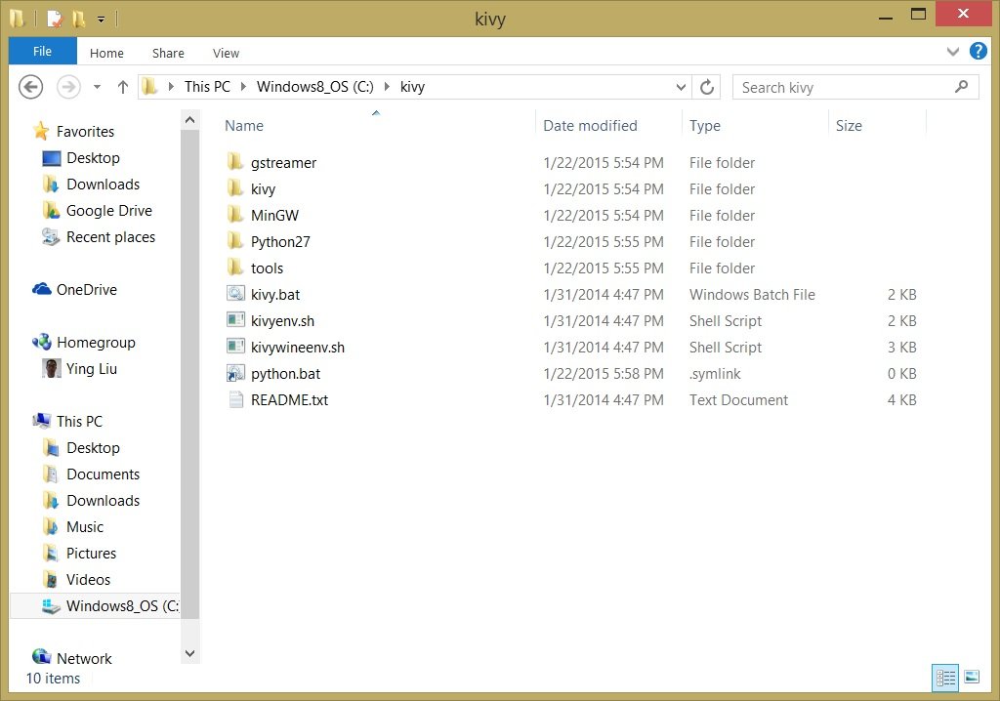
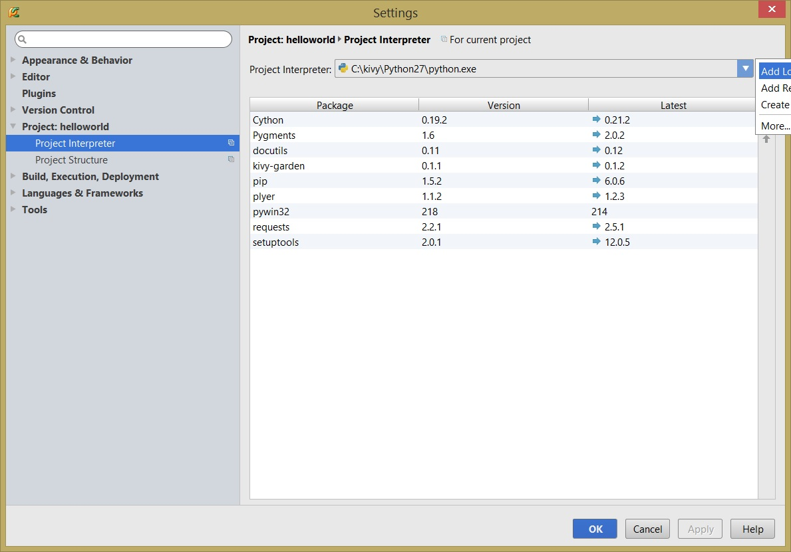
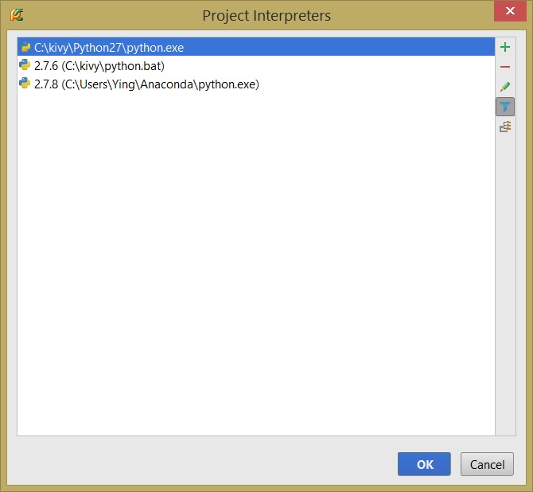
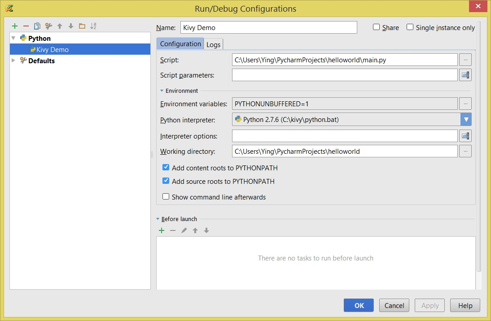
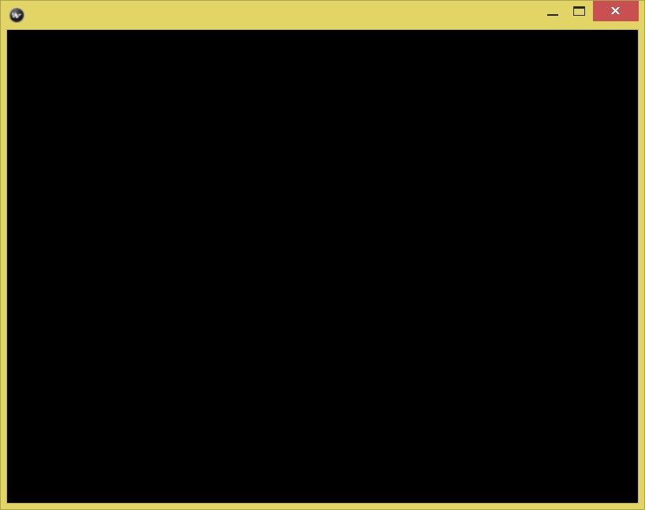

# Introduction

## What is Kivy
Kivy is an open source Python library used to develop multi-touch GUI 
applications. It provides GUI functions and tools such as layout 
management, visual components (widgets), graphic and multi-touch tools
and event handling. It comes with a Pythonic user interface definition 
language called Kv as well as a key/value storage API that 
supports cross-platform development. 

### Why Kivy?
Compared with other GUI frameworks, Kivy has several unique features: 

1. It is a cross-platform Python GUI library / framework. Python is 
a simple, popular, and powerful programming language. Kivy uses
Python and supports different multi-touch platform such as iPhone, 
Android and Windows.
2. It is a relatively new framework that was built from scratch. It
learned from existing frameworks to provide a fresh way to develop
multi-touch applications. 
3. It comes with a user interface language, Kv language, that simplifies
the user interface development and encourages good design.
4. It has supporting tools to build, package and deploy an application 
to run in different platforms. 

Kivy makes modern multi-touch GUI application development much easier. 
For example, [porting the popular 2048 game to Python](http://kivy.org/planet/2014/03/2048-in-python-kivy/)
only takes several hours of an experienced Kivy developer. Kivy has been 
used in a number of iOS and Android applications. 
[Kivy gallery](http://kivy.org/#gallery) has many demo projects. 
 
### Kivy is a library/framework to develop GUI applications
Another way to understand Kivy is from the development tasks required
for a typical GUI application. The following tasks are common tasks for 
most GUI applications:

1. Specify a user interface that includes widgets and layouts. 
2. Generate events for user interactions and application status changes such 
as timeout, location change, battery is low etc.
3. Define event handlers that are linked with events and process events.

For the first task, Kivy provides a rich set of layout and UI components
to let developers to specify the application interface, either using
Python code or, more preferred, using the Kv user interface 
definition language. 
 
All UI widgets come with a set of predefined events that are fired when
certain conditions are met. For example, a mouse click or a touch gesture.

Finally, Kivy allows developers to easily write event handlers and
bind handlers to corresponding events. 

## Kivy Architecture
There are many components in the Kivy library. These components 
can be classified into three layers: the top layer include components 
used by Kivy developers directly. All components, except the Kv language,
in the top layers are provided as Python classes. They include dozens of 
widgets, clock, cache, gesture, events, properties, etc. The Kv language
in the top layer is used to describe the user interface of a Kivy 
application. 

The middle layer includes core providers, graphics, and inputs components. 
The middle layer provides a consistent service layer that acts as 
an abstraction of the runtime platforms. The abstraction allows a 
developers to use the same APIs to open windows, play videos/audios, 
draw graphics, display images, get images from a camera, process  
input events, etc. During deployment, Kivy packages different 
middle layer components for different runtime platforms. 

The bottom layer consists of many existing Python tools and 
Kivy-specific tools to work with the low level graphics, images, 
inputs, and videos. Because these components are hidden below the 
middle layer services, developers don't need to deal with them 
most of the time. 

The middle and bottom layers let all Kivy applications run
natively in all supported platforms. It is also optimized 
to use specific features of the underlying platforms. 
The following diagram in the [Python document website](http://kivy.org/docs/guide/architecture.html)
shows the details and relationships among the three layers. 


## Developing Kivy Applications using PyCharm
Because Kivy package toolchain has some issues to work in Python3, 
we use Python 2.7 to develop Kivy applications and run them in both
desktop and mobile phones. 

PyCharm is a great Python IDE that has many productivity features 
to develop Python applications. PyCharm needs two interpreters 
to edit and run a Kivy application: a project interpreter that 
can find all Kivy modules/classes to get contextual help; 
a bootstrap interpreter to load all libraries to run a Kivy
application. 

The following are steps used to setting up PyCharm for 
Kivy development in Windows.  

###### 1. Download Kivy 
Download Kivy 1.8 for Python 2.7 from http://kivy.org/downloads/1.8.0/Kivy-1.8.0-py2.7-win32.zip.
Unzip the download files to a folder, for example, `C:\kivy`. 
In the folder, you should have a file named `kivy.bat` among other files.
###### 2. Create a Symbol Link to `kivy.bat` 
In Windows, run `cmd` as an administrator to open a shell window. 
Go to `C:\kivy`, create a symbol link for `kivy.bat` using this command: 
`mklink python.bat kivy.bat`. The `python.bat` file is a newly-created symbol 
link of `kivy.bat`.

The reason that we create this symbolic link  is that the `kivy.bat` is 
used to run a Kivy application. However, PyCharm requires an interpreter
be named as `python.bat` or `python.exe`. 

The `C:\kivy` folder should look as the following diagram:



###### 3. Download PyCharm 4.0.x from https://www.jetbrains.com/pycharm/download/.
The professional edition is recommended for its rich functions. Run 
the downloaded exe file to start the installation wizard. Follow the
wizard instructions to install Pycharm.
###### 4. Create a Project Interpreter for Code Editing
Create a new Python project `hello_world` in PyCharm using the 
`File --> New Project` menu . Click the tool icon on the right side of the 
project interpreter list, click `Add Local` to add the 
`C:\kivy\Python27\python.exe` as the project interpreter. 
Below is the dialog: 



Click OK, once in the `Setting` Window, click `Apply` to make it effective.

###### 5. Add Kivy Module/Class Path to the Newly-added Interpreter 
Click the tool icon on the right side of the project interpreter list, 
click `More...` (the last item in the pop up window), select the newly
added interpreter, following is the dialog:



Then on the right side of this dialog, click the 
last icon (the path icon) and the plus icon to add the following path to 
this `Kivy Python` interpreter: `C:\kivy\kivy`.  Below is the dialog:


Click OK two times to return to the `Setting` Window, click `Apply` 
to make it effective. 

Adding the `C:\kivy\kivy` path to the project interpreter allows 
PyCharm to final all Kivy modules and class definitions to provide
contextual editing helps. 
###### 5. Create a Bootstrap InterpreterIn
Click the tool icon on the right side of the 
project interpreter list, click `Add Local` to add the 
the newly created symbol link `C:\kivy\python.bat` as the interpreter.
Click OK, once in the `Setting` Window, click `Apply` to make it effective.

Now the PyCharm has two interpreters, make sure that the 
`C:\kivy\Python27\python.exe` is the project interpreter. If not,
select it and click `Apply` to make it the project interpreter.

## A Testing App
To verify that PyCharm is properly configured to run Kivy Applications, 
we create a simple Kivy app that displays a blank 
Window. 

###### 1. Create a `main.py` Python File 
Create a `main.py` in the `hello_world` project with the following two lines:

```python
from kivy.app import App

App().run()
```

The file is create in [./source](./source) folder. 
###### 2. Create a New Configuration 
In the `Run --> Edit Configurations` menu, click the plus button 
to add a configuration called `Kivy Configuration`, use the `main.py` 
as the script, use the `Kivy Bootstrapper` as the interpreter.
Below is the configuration dialog:
 


###### 3. Run the App
Run the app, you should see a blank window like below:


 
