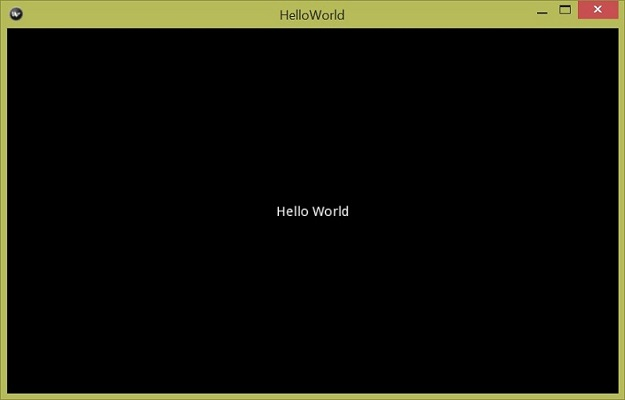

# The Hello World Application
## Three Steps of Building a Kivy App
It's a tradition to say "Hello World" in the first program in learning
a new programming language or a new library. It is a simple requirement
but often shows very important programming concepts. We following
this tradition here. 

Creating a simple Kivy application consists of three steps:

1. Define a subclass of the App class thus we can use many build-in
functions for the App class. 
2. Build the user interface for our application. 
3. Create an instance of the newly created class and call its `run()` 
method to show its user interface. 

## A Minimum Kivy Program
A minimum program `main.py` is created in the (`0201`)[./0201] subdirectory. 
It has the following content: 
    ```python
    # -*- coding: utf-8 -*-

    from kivy.app import App


    class HelloWorldApp(App):
        pass
    
    if __name__ == '__main__':
        HelloWorldApp().run()
    ```
The first line `# -*- coding: utf-8 -*-` tells Python that this program
uses `utf-8` coding. It's a good idea to use `utf-8` coding for all 
program code and strings. Then we import the App class from `kivy.app` 
module. As the first step to create a Kivy application, 
a `HelloWorldApp` class is defined as a subclass of the `App` class.
It is a good idea to name the application class with a `App` postfix
to make it clear that it's a subclass of the `App` class. 
Inside the class definition, the only statement `pass` means that 
we don't build any user interface elements. Therefore Kivy will 
display a blank window when we run it using the class's `run()` method.
This is the third step 
Running the `main.py` script using the PyCharm and Kivy configurations 
described in chapter 1 shows a blank window -- as expected. 

## Saying "Hello World" 
There are two approaches to build the user interface for a Kivy application: 
using Python code or using Kv language. Essentially they are equal because
Kivy will translate Kv definitions into Python code. However, using 
Kv language to specify the user interface is preferred because it 
following one best practice in programming: separation of concerns. 
Separation user interface specification from its processing code 
allows changing a part of the application without changing the other part.
For example, changing a button text color should not affect any code 
that handles the button click event.It also allows the concurrent 
development of the user interface and the business logic behind it. 
A group of designers can use Kv language to specify/develop the user 
interface while Python developers can write code to handle business
logic. Additionally, Kv language is easy to use and easy to understand. 
Nonetheless, understanding that we can create the same user interface
using Python code helps us to understand how Kivy works. 

When a Kivy application starts, it calls the `build()` method of 
a subclass of the App class to get a widget instance. A widget is 
a user interface element. To say "Hello World", we define a 
`build()` method in the `HelloWorldApp` class. In the method we create 
a `Label` widget and set its text to "Hello World", as shown in the 
following code: 
    ```python
    def build(self):
        return Label(text='Hello World')
    ```
Remeber to add `from kivy.uix.label import Label` at the top of the
file to import `Label` class. When we run the program, 
it shows the window as the following picture. 



The method is very simple: it creates a `Label` class instance
using a constructor argument `text='Hello World'`. The whole 
program is in the [`0202`](./0202) folder. As a common mobile phone application, 
a Kivy application has a life cycle too. It starts when we ask Python
to execute the `start()` method. The `start()` method calls the 
application's `build()` to build and display the user interface. It 
then runs in an infinite loop waiting for events. It may pause the 
application, resume the application or stop and destroy the application.
A simplified view of an application's life cycle is depicted in 
the following picture in Kivy's document web site.


## Using Kv Language
As mention in the above section, the second approach to define a 
user interface is to use the Kv language. The Kv language, often referred 
to as `kvlang`, is a simple markup language like HTML. It allows developers
to specify a user interface using a simple, clear markup language that has
a strong Python taste. 

Instead of defining a `build()` method in the `HelloWorldApp` class, 
we keep the `pass` statement as the only statement in the `HelloWorldApp` 
class to make it an empty class. Then we create a kvlang file to 
define the same `Hello World` label as we did in the previous section. 
Kivy requires a kvlang file has a `.kv` postfix. There are two more 
requirements for its name: 1) it should have the same name
in lower cases as its application class  and 2) it does not have 
the `App` postfix. In our case, the file is named as `helloworld.kv`.
It has the following content:
    ```
    Label:
        text: "Hello World"
    ```
A kvlang file uses the same indention syntax as the Python code.
It is also intuitive: here we define a `Label` whose text is "Hello World". 
From its filename we know this `Label` is defined for the `HelloWorldApp` 
class. Run the `main.py` file that has the empty `HelloWorldApp` 
class and we can see the same user interface. The whole application 
are in the (`0203`)[./0203] folder. 


  

