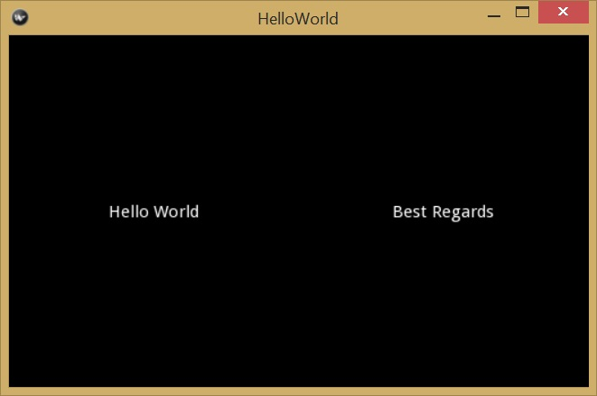

# Widgets and Layouts
## Introduction
A user interface usually has many elements such as input textbox, 
labels, drop down lists, button, radio buttons, etc. These elements
are called widgets in Kivy. Actually everything in the user
interface is a widget. Widgets are the building blocks of 
a Kivy graphic interface. Some widgets are not obvious or invisible.
A special group of widgets are layouts. A layout widget can contain 
other widgets and is used to arrange widgets inside it. 
Developers use layout widgets to control the sizes and 
locations of its child widgets. Kivy provides many widgets 
out of the box. It also let developers to define brand 
new widgets or extend/compose existing widgets
into new widgets. As shown in the previous chapter, a widget can be 
created either by Python code or by a Kv file. Kv files are 
preferred because of its independence, simplicity, and clear syntax.

A widget is represented by a subclass of the `kivy.uix.widget.Widget`
class. A widget may properties such as id, color, text, font size, etc. 
A widget may trigger some events such as touch down, touch move, 
and touch up. For example, the following kvlang code
describes a `Label` element whose `text` property is "Hello World".
 
    ```
    Label:
        text: "Hello World"
    ```
In Python convention, the class name uses so-called Pascal casing 
that the first letter of a word is an uppercase letter. Widget 
properties such as `text` are lower-case.

## Widget Tree
A user interface usually has many widgets. Like a window that has many
components in it, a widget can have multiple child widgets. 
A child widget can have only one parent widget. Because of this 
parent-child relationship, all widgets in a user interface 
form a tree structure. 

Also like a tree, there is only a single widget call `root` 
widget that doesn't have a parent widget. In the above "Hello World"
example, the `Label` element is the only widget in the user interface 
and it is the `root` widget. Another hint for a `root` widget is that 
it is the leftmost widget in a Kv file. Indented contents are either 
properties or child elements. 

Usually a `root` widget is a layout widget that has one or more
child widgets. In a Kv file, the parent-child relationship are 
declared using indentation. The following kvlang code describes a 
`GridLayout` widget that has two `Label` elements as its child
widgets. 

    ```
    GridLayout:
        Label:
            text: "Hello World"
        Label:
            text: "Best Regards"
    ```
In this Kivy file, the `GridLayout` is one of many Kivy layout widgets 
that can have multiple child widgets. It is the leftmost widget 
in the Kv file thus it is a root widget. Running the `main.py` 
and `helloworld.kv` in the folder [./source/0301](./source/0301) 
will display the following window: 



## Manage Widget Tree Using Python Code
Many times we want to change a widget tree at runtime to give a 
more responsive user interface. Kv files are good for static content. 
To change a widget tree dynamically, we need to use Python code. 
We need to know both the Kv syntax and the Python methods to build 
and change a user interface. 

In Kivy, all children widget of a widget are stored in its `children` 
attribute. Kivy provides the following methods to manipulate the children of 
a parent widget: 

* `add_widget()`: add a child widget
* `remove_widget()`: remove a child widget 
* `clear_widget()`: remove all child widgets
* Iterate over children: because the `children` attribute is a list, we can 
iterate over the list using a `for` statement such as 
`for child in my_widget.children`

To make a user interface that has two labels as the above example, 
we can use the following code from [./source/0302](./source/0302):

    ```python
    from kivy.app import App
    from kivy.uix.gridlayout import GridLayout
    from kivy.uix.label import Label
    
    
    class HelloWorldApp(App):
        def build(self):
            layout = GridLayout(cols=2)
            hello_label = Label(text="Hello World2")
            best_label = Label(text="Best Regards")
            layout.add_widget(hello_label)
            layout.add_widget(best_label)
            return layout
    
    if __name__ == '__main__':
        HelloWorldApp().run()
    ```


