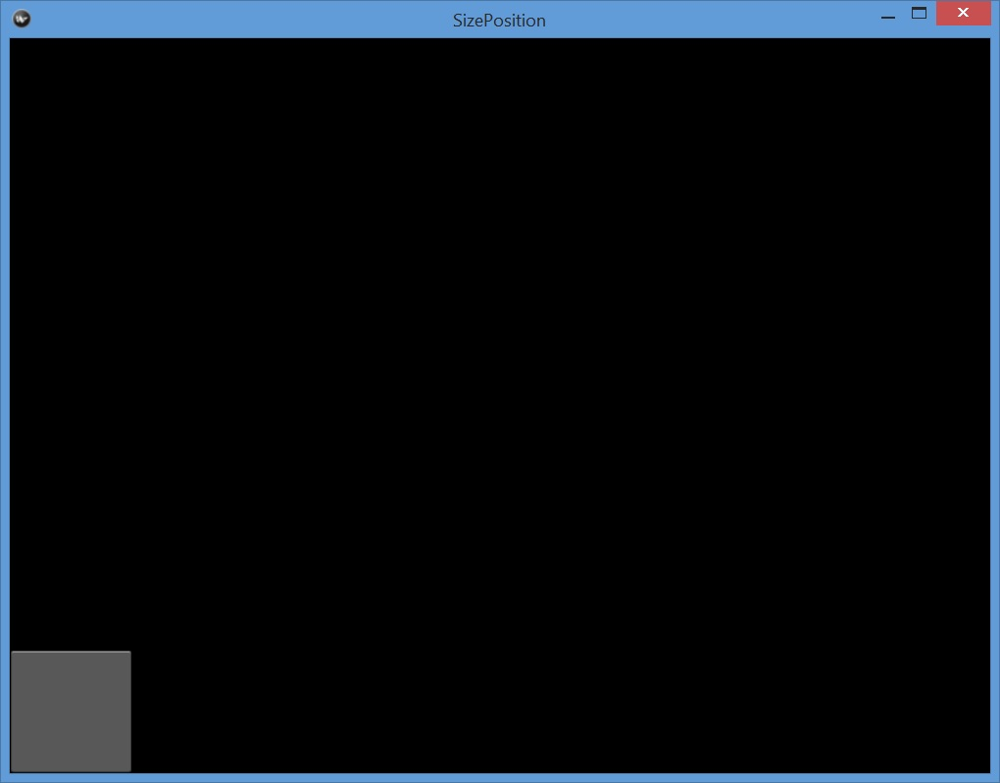
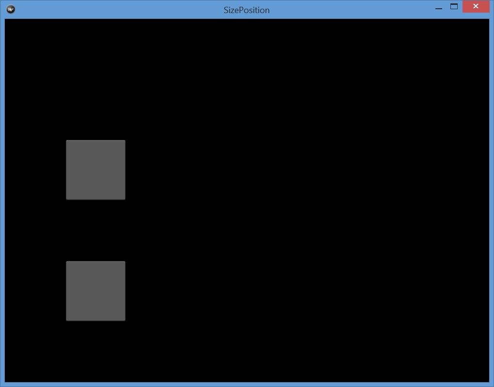
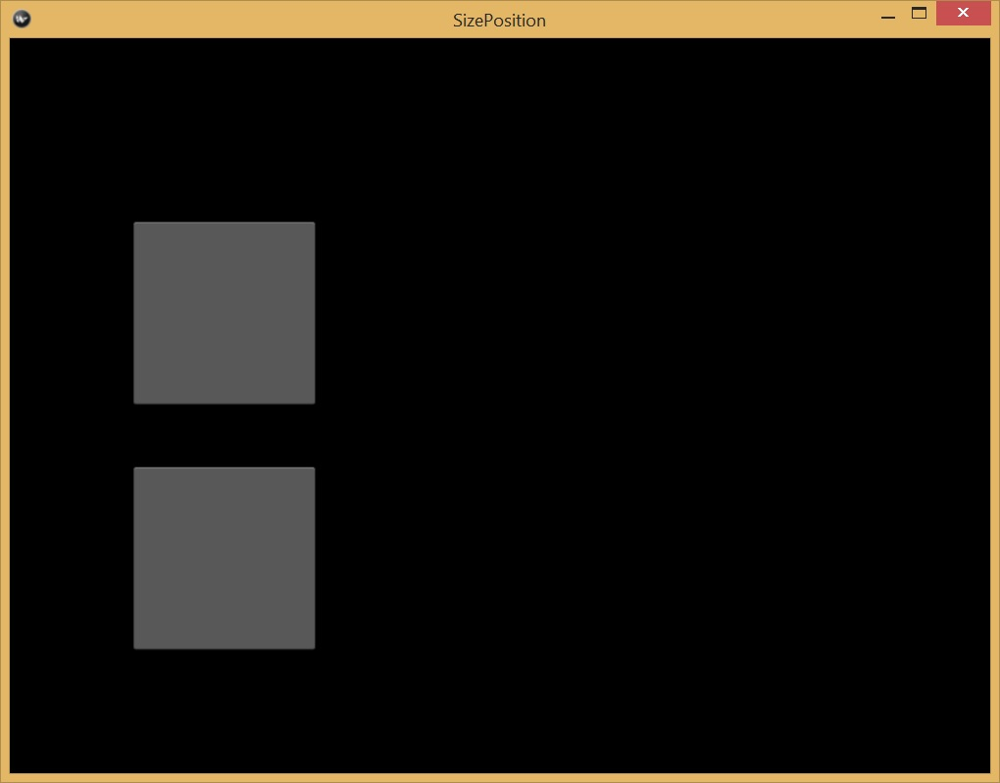

# Widgets and Widget Tree
## Introduction
A user interface usually has many elements such as input textbox, 
labels, drop down lists, button, radio buttons, etc. These elements
are called widgets in Kivy. Actually everything in the user
interface is a widget. Widgets are the building blocks of 
a Kivy graphic interface. Some widgets are not obvious and invisible.
A special group of widgets are container widgets that are used to 
group other widgets into a easy-to-use and easy-to-manage group. 
We will see some layout widgets that can contain other widgets. 
Developers use layout widgets to control the sizes and 
locations of the contained widgets. Kivy provides many widgets 
out of the box to make it possible to quickly develop a GUI application. 
It also let developers to define a brand-new widgets 
or extend/compose existing widgets into new widgets. 
As shown in the previous chapter, a widget can be 
created either by Python code or by a Kv file. If possible, Kv files are 
preferred because of its independence, simplicity, and clear syntax.
However, many times we need to use Python code to manage 
a user interface dynamically. 

A widget is represented by a subclass of the `kivy.uix.widget.Widget`
class. A widget may have properties such as id, color, text, 
font size, etc. A widget may trigger some events such as touch down, 
touch move, and touch up. For example, the following kvlang code
describes a `Label` element whose `text` property is "Hello World".
 
```
Label:
    text: "Hello World"
```

In Python convention, the class name uses so-called Pascal casing 
that the first letter of a word is an uppercase letter. Widget 
properties such as `text` are lower-case.

## Widget Tree
A user interface usually has many widgets. Like a window that has many
components in it, a widget can have multiple child widgets. 
A child widget can have only one parent widget. Because of this 
parent-child relationship, all widgets in a user interface 
form a tree structure. 

Also like a tree, there is only a single widget call `root` 
widget that doesn't have a parent widget. In the above "Hello World"
example, the `Label` element is the only widget in the user interface 
and it is the `root` widget. Another hint for a `root` widget is that 
it is the leftmost widget in a Kv file. Indented contents are either 
properties or child elements. 

Usually a `root` widget is a layout widget that has one or more
child widgets. In a Kv file, the parent-child relationship are 
declared using indentation. The following kvlang code describes a 
`GridLayout` widget that has two `Label` elements as its child
widgets. 

```
GridLayout:
    Label:
        text: "Hello World"
    Label:
        text: "Best Regards"
```

In this Kivy file, the `GridLayout` is one of many Kivy layout widgets 
that can have multiple child widgets. It is the leftmost widget 
in the Kv file thus it is a root widget. Running the `main.py` 
and `helloworld.kv` in the folder [./source/0301](./source/0301) 
will display the following window: 


## Manage Widget Tree Using Python Code
Many times we want to change a widget tree at runtime to give a 
more responsive user interface. Kv files are good for static content. 
To change a widget tree dynamically, we need to use Python code. 
We need to know both the Kv syntax and the Python methods to build 
and change a user interface. 

In Kivy, all children widget of a widget are stored in its `children` 
attribute. Kivy provides the following methods to manipulate the children of 
a parent widget: 

* `add_widget()`: add a child widget
* `remove_widget()`: remove a child widget 
* `clear_widget()`: remove all child widgets
* Iterate over children: because the `children` attribute is a list, we can 
iterate over the list using a `for` statement such as 
`for child in my_widget.children`

To make a user interface that has two labels as the above example, 
we can use the following code from [./source/0302](./source/0302):

```python
from kivy.app import App
from kivy.uix.gridlayout import GridLayout
from kivy.uix.label import Label


class HelloWorldApp(App):
    def build(self):
        layout = GridLayout(cols=2)
        hello_label = Label(text="Hello World")
        best_label = Label(text="Best Regards")
        layout.add_widget(hello_label)
        layout.add_widget(best_label)
        return layout


if __name__ == '__main__':
    HelloWorldApp().run()
```

In the `build` method of the `HelloWorldApp` class (a subclass of the 
Kivy's `App` class), we first create a `GridLayout` that has two columns. 
We need the `cols=2` constructor parameter to put the two labels 
side-by-side in the middle. Then we create two labels with their texts
and add them to the layout using the `add_widget` method.

## Widget Size and Position
Two essential properties of any graphic interface component are 
its size and position. Kivy follows some simple principles to manage
the size and position of all widgets in a user interface. 

Most widgets have a default size and a default position. 
For example, the following code in [./source/0303](./source/0303)
shows the default size and position of three widgets: a root 
widgets and two button child widgets. 

```python
from kivy.app import App
from kivy.uix.widget import Widget
from kivy.uix.button import Button


class SizePositionApp(App):
    def build(self):
        root_widget = Widget()
        button_1 = Button()
        button_2 = Button()
        root_widget.add_widget(button_1)
        root_widget.add_widget(button_2)
        return root_widget


if __name__ == '__main__':
    SizePositionApp().run()
```

In the above code, we use the bare `Widget` class to demonstrate the 
sizing and positing behaviors. This app display the following diagram.



In a Windows desktop, a root widgets uses all space of the user 
interface window. In my Windows 8.1 computer, 
the Kivy root window has a default size of 1020px and 799px, 
i.e., a width of 1020 pixels and a height of 799 pixels. 
The window has a default position that is on the top 
right part of the computer screen. 
A button widget has a default size of 100px width and 100px length. 
The default position is on the bottom left corner of its parent. 
In the above diagram we can only see one button because one is 
on top of the other one.

In Kivy, the sizing and positioning decision involves both 
a parent widgets and all its children: 
a child widget specifies its size or position parameters 
and it is up to its parent, the one that has the "big" view, 
to determine the actual size/position values of its children. 
In some situations a parent widget may choose to use its rules and 
ignore its children's size and position specifications.

Kivy uses a pair of `(x, y)` coordinates to specify the position of
a widget in its parent. `x` is the horizontal value where `0` means
the left side. Similarly, `y` is tht vertical value where `0` means
the bottom of a widget. In the above code, the default positions of both
buttons are `(0,0)` in the root widget. To change their positions,
we can set the `pos` property using the following code 
in [./source/0304](./source/0304):
 
```python
button_1 = Button(pos=(100, 100))
button_2 = Button(pos=(100, 300))
```

The app places the bottom-left corner of the button 1 at the `(100, 100)` 
and the bottom-left corner of the button 2 at the `(100, 300)` 
position of the root widget. The diagram is as the following: 



The `pos` parameter specifies the horizontal `x` and vertical 
`y` properties of a widget. Actually, `x`, `y` and `pos` are 
all properties of a widget. The above two lines could be written
as the following to have the same effect: 

```python
button_1 = Button()
button_1.pos = (100, 100)
button_2 = Button()
button_2.x = 100
button_2.y = 300
```

Similarly, Kivy uses `width`, `height` and `size` to specify a
widget size. The following code in [./source/0305](./source/0305)
increase each side of a widget to 150px: 

```python
from kivy.app import App
from kivy.uix.widget import Widget
from kivy.uix.button import Button


class SizePositionApp(App):
    def build(self):
        root_widget = Widget()
        button_1 = Button()
        button_1.pos = (100, 100)
        button_1.size = (150, 150)
        button_2 = Button()
        button_2.x = 100
        button_2.y = 300
        button_2.width = 150
        button_2.height = 150
        root_widget.add_widget(button_1)
        root_widget.add_widget(button_2)
        return root_widget


if __name__ == '__main__':
    SizePositionApp().run()
```

The diagram is as the following: 



Managing size and position is a complex task for any non-trivial 
GUI application. Luckily, Kivy provides a rich set of layout class
and methods to simplify this task. 

## Use a Kv File to Set Size and Position
It is more straightforward to use a Kv file to specify the size
and position values of a widget. The last example places two 
buttons at the location of (100, 100) and (100, 300). It
sets the button's height and width to 150px. Using a Kv file
`sizeposition.kv` that is named after the widget's class name 
(all lowercase without the "App" postfix), it is easy to 
make the same user interface with the following code:

```
Widget:
    Button:
        pos: 100, 100
        size: 150, 150
    Button:
        x: 100
        y: 300
        width: 150
        height: 150
```

The Python code `main.py` file becomes much smaller as shown below:

```Python
from kivy.app import App


class SizePositionApp(App):
    pass

if __name__ == '__main__':
    SizePositionApp().run()
```

All files can be found in the [./source/0305](./source/0305) folder. 

## Exercises:
Try to play other widgets such as `Label` or `Image` to set
their positions and sizes. Use both a Kv file method and the Python
code method to set a widget's size and position.
